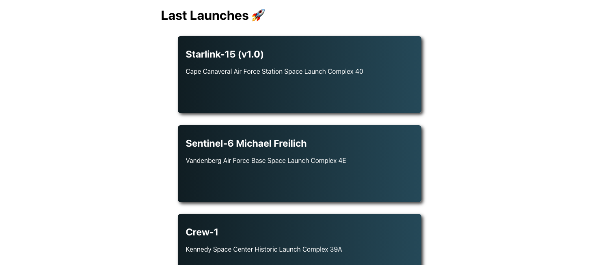

# 99minutos Frontend Engineer Interview - APP

React frontend created with `create-react-app` 4.0.1 and `node` 12.19.0 

### Prerequisites

You need to have installed the following:

* [npm -- node environment]  (https://nodejs.org/en/download/) - Required to install dependencies
* IDE or Text Editor [VisualCode] (https://code.visualstudio.com/) - Visual Code was used to develop

### Installing

#### Clone the Repository
```
https://github.com/ecarradal/99minutos-frontend-interview-test.git
```

Clone the repository in your host, download al dependencies with the following command:

```
npm install
```

# Run Project

If you already have all the dependencies installed without any problem, just run the following command:

```
npm start
```

## R̶u̶n̶n̶i̶n̶g̶ ̶T̶e̶s̶t̶s̶ ̶(̶U̶n̶d̶e̶r̶ ̶d̶e̶v̶e̶l̶o̶p̶i̶n̶g̶)̶

To run the unit test you just need to run the following command:

```
npm test
```

## Troubleshooting

If you have problems to run `npm install`, please check your node version:

```
node -v
```

***

## APP Screen Shots




## Technologies decision

I choose React because is more simple, lightweight and allows to create applications more faster than Angular, I also decided to use React because unlike Angular, I have used it less, and this allows me to reinforce my knowledge.

## Improvements in my submission

The project can be solved quickly if only two components are created, one the list of missions and another with the information of the mission. But my own subconscious does not allow to do it that way, since the frontend is much more than that.

It is about making UI that have a good UX, and that look beautiful, that the app is easy to maintain, and structure the project in the most organized way. A good frontend in addition to good code, requires good UI.

That is why I takes additional time in the selection of colors, the interaction with the elements, giving feedback to the user about the status of the app (API Request), responsive design, making the elements look beautiful, among other small details.

## If I had more time

I would focus on unit tests since although I started developing following this pattern, I had problems as I progressed, which worries me since it was a requirement. And since I don't have much experience with them, I decided to make up for it with a good UX / UI design which is the part where I have a lot of experience.

`I already started learning more about the tests :D`
